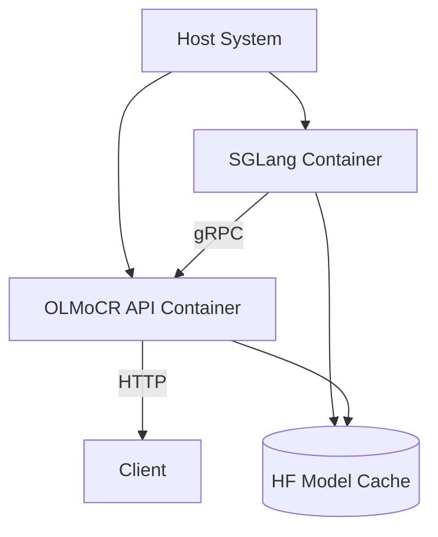

# OLMoCR Docker Deployment Resolution Plan

## Architecture Overview


## Critical Fixes

### 1. CUDA Configuration
```dockerfile
# Dockerfile
FROM nvidia/cuda:12.2.0-devel-ubuntu22.04

# Set CUDA environment
ENV CUDA_HOME=/usr/local/cuda-12.2
ENV PATH=$CUDA_HOME/bin:$PATH
ENV LD_LIBRARY_PATH=$CUDA_HOME/lib64:$LD_LIBRARY_PATH
```

### 2. Python Environment
```dockerfile
# Install Python 3.10
RUN apt-get install -y python3.10 python3.10-dev python3.10-venv

# Set default Python
RUN update-alternatives --install /usr/bin/python3 python3 /usr/bin/python3.10 1
```

## Dependency Management

### 1. Core Packages
```dockerfile
RUN uv pip install --system --no-cache \
    torch==2.6.0+cu122 \
    torchvision==0.21.0+cu122 \
    transformers==4.51.1 \
    flashinfer==0.2.5 \
    xformers==0.0.28.post3 \
    lingua==0.7.1
```

### 2. Service Configuration
```yaml
# docker-compose.yml
services:
  sglang:
    image: lmsysorg/sglang:cuda12.2
    healthcheck:
      test: ["CMD", "curl", "-f", "http://localhost:30024/health"]
      interval: 10s
      timeout: 5s
      retries: 10
```

## Implementation Steps

1. Update base images for CUDA 12.2 compatibility
2. Align Python versions between local and container
3. Install version-pinned dependencies
4. Add service health monitoring
5. Implement model pre-download
6. Configure shared GPU resources

## Validation Checklist
- [ ] CUDA version match (12.2)
- [ ] Torch CUDA availability
- [ ] SGLang healthcheck passes
- [ ] Model loading verification